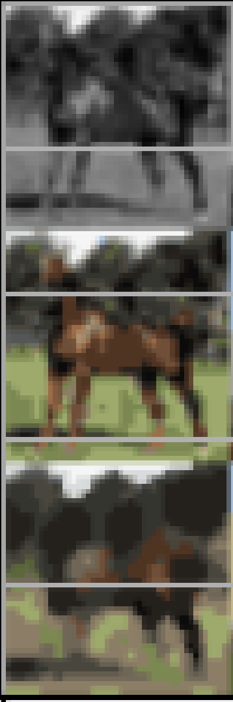
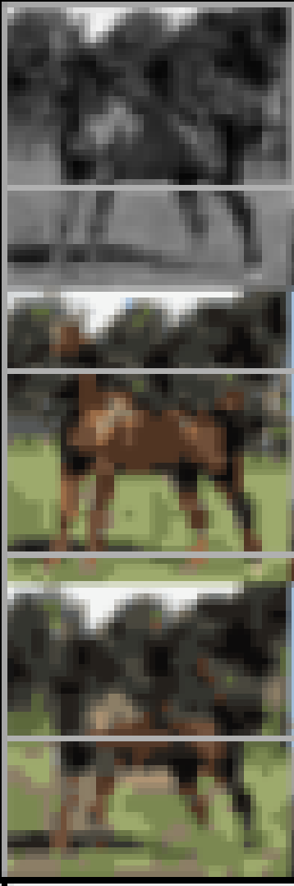
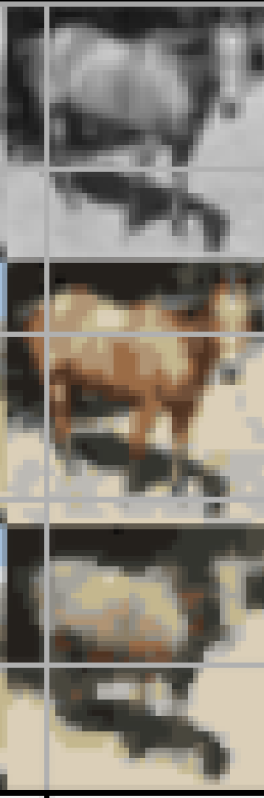
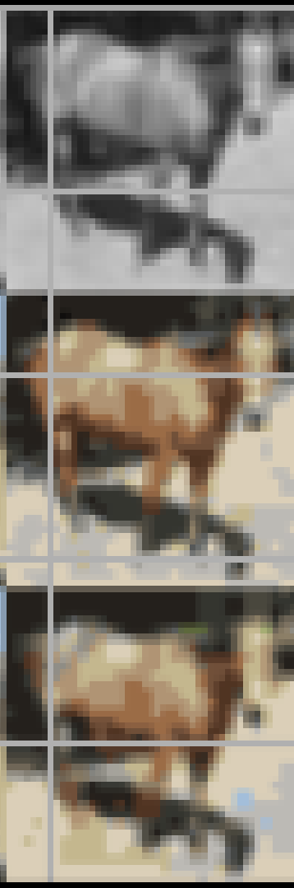

# Convolutional Neural Network (CNN) Architecture for Image Colorization

This is a simple CNN architecture for image colorization based on [assignment 2](http://www.cs.toronto.edu/~rgrosse/courses/csc421_2019/assignments/assignment2.pdf) of the Neural Networks and Deep Learning course of the University of Toronto. See more information in the course page [here](http://www.cs.toronto.edu/~rgrosse/courses/csc421_2019/).

The goal is to colorize grayscale images (e.g, given a black and white image, predict the colors in the image). This is not a straightforward problem because the mapping from grayscale to color is not one-to-one. For example, a grayscale image of a red apple could be colorized in many different ways, depending on the color of the apple.

It is insightful to check the model behavior by visualizing the predictions. The image below shows the model grayscale input, the true color image, and the model prediction, from top to bottom.

|  |  |
|:---------------------------------------------------------------:|:---------------------------------------------------------------:|

The image on the left (epoch 0) has a much lower color contrast than the image on the right (epoch 24). The model is learning to represent colors as the training progresses. Another example:

|  |  |
|:---------------------------------------------------------------:|:---------------------------------------------------------------:|

The image at epoch 0 is much closer to the grayscale input than the original image. At epoch 24, the colors of the image are more vibrant and start to resemble the original image.

## Why are CNNs used for Image Processing and Computer Vision?

The overall architecture of CNNs achieves three things:

1. Because it preserves the symmetries of the input (see details below), a CNN has a better inductive bias [[1]](https://en.wikipedia.org/wiki/Inductive_bias) and therefore learns image representation more effectively than, for example, a similarly-sized fully-connected network (see details in [^1] and the symmetry section below).

2. The usage of both convolution and pooling layers enables the hierarchical learning of features. Early layers detect simple elements such as edges, textures, and basic shapes.
Intermediate layers combine these basic features to recognize more complex structures like corners, contours, and parts of objects.
The deeper layers capture high-level information, including entire objects and backgrounds.

3. The generality of features learned in the early layers allows the same CNN architecture to be applied to multiple tasks.
In this assignment, for instance, the network is used for both image colorization (find an image's true colors from a grayscale input) and super-resolution (e.g., enhancing an image's resolution).

To go deeper, we have to understand the operations of convolution and pooling:

- Convolutions ensure that each neuron is connected only to a small, localized region of the input image. This allows the network to learn and preserve spatial hierarchies of features. Because convolutions are translation equivariant (see note [^2] below), this helps the network to recognize the same feature regardless of its position in the image.
<!---
TODO: Not very well written. Improve the explanation of why convolutions are useful. Ask Marvin for feedback
-->
- It is the combination of convolution and pooling layers that introduces translational invariance, allowing feature recognition regardless of its position in the image. Pooling layers also help in two ways: 1) identify the sharpest features in the image, and 2) increase the effective receptive field of a layer (e.g., it can connect different parts of the image which might have similar information as a repeating background). For a nice visualization of the pooling operation, see [here](https://www.youtube.com/watch?v=KKmCnwGzSv8).

## A very simple example of symmetries in action

Let us consider a simple example of how symmetries can be used to constrain a model of nature. Imagine that, on a beautiful summer day, you are near a pond and happen to see a stone being dropped into it.

The result should be similar to what is shown above: circular 2D waves propagating outwards from the point where the stone entered the water.

Our goal is to model the profile of the waves at a certain time and place, $A(t,x,y)$. Supposing we knew nothing about wave equations [[2]](https://en.wikipedia.org/wiki/Wave_equation) in physics, we could collect data - by measuring the amplitude of the waves at each time instant and position - and then model it by fitting a function to the data, $\hat{A}(t, x, y) = f(t, x, y)$.

However, we should let the data (more fundamentally, the physical process behind the data generation) inform our judgement: the shape of the waves is symmetric in all spatial directions. Therefore, whatever the functional form of model $f(t, x, y)$ might be, it must match our observation that $A(t, x, y)= A(t, x , -y) = A(t, -x , y) = A(t, -x , -y)$[^3].

In other words, the symmetries of the data have imposed a restriction on our model, as the universe of functions that we could use for fitting the data has now reduced to those that respect the symmetry of the data.
<!---
TODO: Connect this to Neural Networks as being the same principle in action
- Show that the number of functions that respect the symmetry is necessarily smaller than the number of functions that do not.
As a simple example, consider a polynomial expansion of A and show that, using the constraints above to generate a system of linear equations, that all the odd terms must be zero.
-->

[^1]: In particular, the network architecture - that is, the complicated function that takes an image and tell us whether there is a horse on it or not - is designed so that it respects the symmetries of the data. These symmetries constrain the space of possible solutions, allowing the network to better generalize.

[^2]: For practical purposes, equivariance means that if the input image is translated by a certain amount, the feature maps generated by the convolutional layers are shifted by the same amount and direction. This is very useful because the network learns the features associated with a monkey (a long tail, a cute nose, etc.) regardless of the position of the monkey in the image. As a friend put it, "a monkey translated is still the same monkey." (Draw an example with a translated monkey)

[^3]: In reality, the symmetry of the problem (e.g, described by the $SO(2)$ group together with reflections) is more powerful than this. We avoid introducing spherical coordinates for simplicity.
