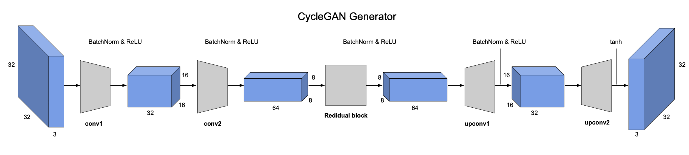

# GANs for image generation and image-to-image translation

The two examples displayed here are mostly derived from [assignment 4](http://www.cs.toronto.edu/~rgrosse/courses/csc421_2019/assignments/assignment3.pdf) of the Neural Networks and Deep Learning course of the University of Toronto. See more information in the course page [here](http://www.cs.toronto.edu/~rgrosse/courses/csc421_2019/).

In the first part, a Deep Convolutional GAN (DCGAN) is built and trained to generate images from random noise.

In the second part, a CycleGAN is built and trained to translate images from one domain to another. The example provided here is the translation from Windows to Apple emojis.

## DCGAN

This is a Generative Adversarial Network that uses a CNN as the discriminator and a network of transposed convolutions as the generator. The discriminator is composed by a sequence of convolution layers followed by BatchNorm and ReLu. The discriminator architecture is as follows:

Removing BatchNorm negatively impacts the model performance. For more details on Batch Normalization, see the original paper [here](https://arxiv.org/abs/1502.03167).

The generator is composed by a sequence of upsample plus convolution layers followed by BatchNorm and ReLu. These progessively upsample the input noise in order to generate a fake image with the appropriate dimensions. The generator architecture is as follows:

## CycleGAN

Use a conditional GAN to translate images from one domain to another. The loss functions include extra terms in addition to the standard GAN losses to express contraints on the types of images that are generated. In this particular case, the constraint is that the generated image should be the same as the input image when translated back to the original domain (i.e, $X \rightarrow Y \rightarrow X$).
CycleGANs are especially powerful because they do not require paired data for training. The discriminator architecture is built in 3 stages:

1. Encode the input image with a sequence of convolution layers that extract the image features;
2. Transform the image features by passing them through several residual blocks. This is done so that the characteristics of the output image do not differ too much from the input;
3. Decodes the transformed features using a sequence of transposed convolution layers to build an ouput image with the same dimensions as the input;

