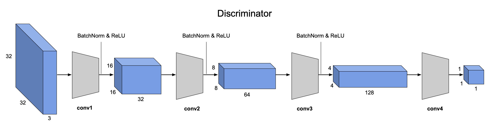
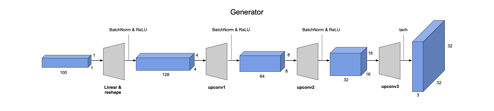

# GANs for image generation and image-to-image translation

This two examples displayed here are mostly derived from [assignment 4](http://www.cs.toronto.edu/~rgrosse/courses/csc421_2019/assignments/assignment3.pdf) of the Neural Networks and Deep Learning course of the University of Toronto. See more information in the course page [here](http://www.cs.toronto.edu/~rgrosse/courses/csc421_2019/).

In the first part, a Deep Convolutional GAN (DCGAN) is built and trained to generate images from random noise.

In the second part, a Cycle GAN is built and trained to translate images from one domain to another. The example provided here is the translation from Windows to Apple emojis.

## DCGAN

This is a Generative Adversarial Network that uses a CNN as the discriminator and a network of transposed convolutions as the generator. The discriminator is composed by a sequence of convolution layers followed by BatchNorm and ReLu. The architecture is as follows:

Removing BatchNorm negatively impacts the model performance. For more details on Batch Normalization, see the original paper [here](https://arxiv.org/abs/1502.03167).

The generator is composed by a sequence of upsample plus convolution layers followed by BatchNorm and ReLu. These progessively upsample the input noise in order to generate a fake image with the appropriate dimensions. The architecture is as follows:

