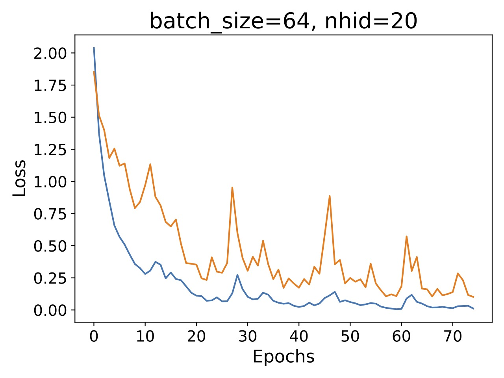
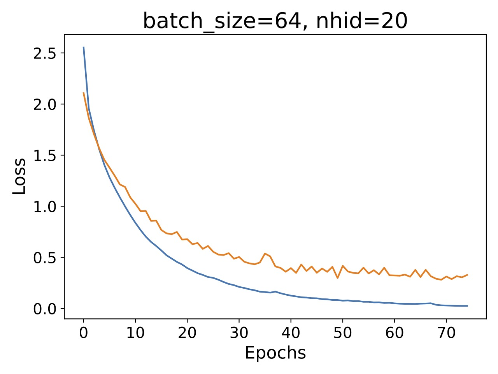

# Learning rate effects on the model training

When training the transformer model with the default learning rate of 0.005 (see left), we observed that the loss was fluctuating considerably. At first, we considered the possibility that model complexity was too high and these fluctuations were due to overfitting. However, after reducing the learning rate to 0.001, we observed that the loss decreased more smoothly (see right).

This suggests that the learning rate was too high and the loss jumps are due to the stochastic nature of gradient descent (see example below). Of course, the trade-off is that the model takes longer to converge with a lower learning rate.

|  |  |
|:---------------------------------------------------------------:|:---------------------------------------------------------------:|

For more details on the influence of the learning rate in gradient descent, see the following [link](https://srdas.github.io/DLBook/GradientDescentTechniques.html), in particular Fig. 7.2.
